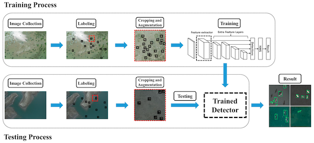

This survey is intended to consolidate recent efforts on animal conservation using remote imaging (UAVs, manned flights, or satellite imagery).  This page is maintained by <a href="https://www.wur.nl/en/Persons/Benjamin-BA-Benjamin-Kellenberger-MSc.htm">Benjamin Kellenberger</a> and <a href="http://dmorris.net">Dan Morris</a>.  Contributions are welcome!  Please submit additions or corrections as GitHub pull requests.

#  1. Contents

  [1. Contents](#Contents) 
  [2. Research Articles](#ResearchArticles) 
  [3. Case Studies](#CaseStudies) 
  [4. Further Reading](#FurtherReading) 
 
 
 
#  2. Research Articles

Papers are ordered alphabetically by the last name of the first author. If possible, links, images and a brief summary are provided.  

<!--
**Chen, Chien-Hung, and Keng-Hao Liu. "Stingray detection of aerial images with region-based convolution neural network." _2017 IEEE International Conference on Consumer Electronics-Taiwan (ICCE-TW)_. IEEE, 2017.**

TODO

*Keywords: deep learning, faster r-cnn, marine*  
-->

**[Corcoran, Evangeline, et al. Automated detection of koalas using low-level aerial surveillance and machine learning. Scientific reports 9.1 (2019): 3208.](https://www.nature.com/articles/s41598-019-39917-5.pdf)**

The authors employ an ensemble of off-the-shelf Faster R-CNN and YOLO models (predictions fused by averaging) to detect koalas. Noteworthy detail: double-counts due to overlapping images are resolved by finding correspondences (via ORB features) and averaging the detection heatmaps in the overlap zones.

Dataset available on request.

*Keywords: deep learning, faster r-cnn, wild mammals*

&nbsp;&nbsp;&nbsp;&nbsp;&nbsp;&nbsp;  

**[van Gemert, Jan C., et al. Nature conservation drones for automatic localization and counting of animals. European Conference on Computer Vision. Springer, Cham, 2014.](https://staff.fnwi.uva.nl/p.s.m.mettes/papers/drones-eccvw14.pdf)**

Traditional ML methods (DPM, eSVM) for cattle detection. They also do counting using videos and a KLT tracker. One of the early works, with a straightforward dataset.

*Keywords: SVM, tracking, cattle*

&nbsp;&nbsp;&nbsp;&nbsp;&nbsp;&nbsp;  

**[Hong, Suk-Ju, et al. Application of Deep-Learning Methods to Bird Detection Using Unmanned Aerial Vehicle Imagery. Sensors 19.7 (2019): 1651.](https://www.mdpi.com/1424-8220/19/7/1651)**

Comparison of standard detectors (Faster R-CNN, R-FCN, SSD, YOLO) on birds. Interesting detail: they also use bird decoys for data augmentation.

*Keywords: deep learning, faster r-cnn, r-fcn, ssd, yolo, birds*

&nbsp;&nbsp;&nbsp;&nbsp;&nbsp;&nbsp;  

**[Kellenberger, Benjamin, Diego Marcos, and Devis Tuia. Detecting mammals in UAV images: Best practices to address a substantially imbalanced dataset with deep learning. Remote sensing of environment 216 (2018): 139-153.](https://arxiv.org/pdf/1806.11368.pdf)**

This paper presents tricks to handle the scarcity of animals in UAV imagery.

Dataset freely available.

*Keywords: deep learning, resnet, wild mammals*

&nbsp;&nbsp;&nbsp;&nbsp;&nbsp;&nbsp;  

**[Okafor, Emmanuel, et al. Operational data augmentation in classifying single aerial images of animals."2017 IEEE International Conference on INnovations in Intelligent SysTems and Applications (INISTA). IEEE, 2017.](http://www.ai.rug.nl/~mwiering/GROUP/ARTICLES/INISTA_Data_Augmentation_Okafor.pdf)**

**[Okafor, Emmanuel, Lambert Schomaker, and Marco A. Wiering. An analysis of rotation matrix and colour constancy data augmentation in classifying images of animals. Journal of Information and Telecommunication 2.4 (2018): 465-491.](https://www.tandfonline.com/doi/full/10.1080/24751839.2018.1479932)**

These papers focus on maximizing the variability of the animals a CNN gets to see; the authors position individuals in all rotational variations across the screen, in-painting holes with nearest neighbors.*

*Keywords: deep learning, cattle*

&nbsp;&nbsp;&nbsp;&nbsp;&nbsp;&nbsp;  

**[Rey, Nicolas, et al. "Detecting animals in African Savanna with UAVs and the crowds." Remote sensing of environment 200 (2017): 341-351.](https://arxiv.org/pdf/1709.01722)**

Mammal detection in the African savanna using hand-crafted features (histogram of colors, bag of visual words) and an exemplar SVM.

*Keywords: exemplar SVM, wild mammals*

&nbsp;&nbsp;&nbsp;&nbsp;&nbsp;&nbsp;  

**[Rivas, Alberto, et al. Detection of Cattle Using Drones and Convolutional Neural Networks. Sensors 18.7 (2018): 2048.](https://www.mdpi.com/1424-8220/18/7/2048)**

Heatmap-based animal detection in low-altitude imagery that provides relatively clear foreground/background separability. The authors use a custom CNN that is similar to LeNet.

*Keywords: deep learning, cattle*

&nbsp;&nbsp;&nbsp;&nbsp;&nbsp;&nbsp;  

**[Andrew William, Colin Greatwood, and Tilo Burghardt. Visual localisation and individual identification of Holstein Friesian cattle via deep learning. Proceedings of the IEEE International Conference on Computer Vision. 2017.](http://openaccess.thecvf.com/content_ICCV_2017_workshops/papers/w41/Andrew_Visual_Localisation_and_ICCV_2017_paper.pdf)**

Combination of off-the-shelf models (R-CNN and a KCF tracker) for cattle monitoring.

*Keywords: deep learning, kcf, tracking, cattle*

&nbsp;&nbsp;&nbsp;&nbsp;&nbsp;&nbsp;  

**[Longmore, S. N., et al. Adapting astronomical source detection software to help detect animals in thermal images obtained by unmanned aerial systems. International Journal of Remote Sensing 38.8-10 (2017): 2623-2638.](https://arxiv.org/pdf/1701.01611.pdf)**

This paper does peak finding by thresholding, followed by HOG and SVM, to detect animals in thermal imagery.

*Keywords: svm, thermal, cattle*

&nbsp;&nbsp;&nbsp;&nbsp;&nbsp;&nbsp;  

**[Bondi, Elizabeth, et al. Spot poachers in action: Augmenting conservation drones with automatic detection in near real time. Thirty-Second AAAI Conference on Artificial Intelligence. 2018.](https://www.aaai.org/ocs/index.php/AAAI/AAAI18/paper/download/16282/16380)**

An integrated, cloud-based framework that uses Faster R-CNN on thermal data to localize poachers.

*Keywords: deep learning, faster r-cnn, thermal, poaching*

&nbsp;&nbsp;&nbsp;&nbsp;&nbsp;&nbsp;  

**[Bondi, Elizabeth, et al. AirSim-W: A Simulation Environment for Wildlife Conservation with UAVs. Proceedings of the 1st ACM SIGCAS Conference on Computing and Sustainable Societies. ACM, 2018.](https://www.cais.usc.edu/wp-content/uploads/2018/05/bondi_camera_ready_airsim-w.pdf)**

Uses a rendering engine ([AirSim](https://github.com/microsoft/AirSim), based on the Unreal Engine) to simulate an African ecosystem and derive thermal signatures for detector training.

*Keywords: deep learning, thermal, simulation*

&nbsp;&nbsp;&nbsp;&nbsp;&nbsp;&nbsp;  

# 3. Case Studies

**Delair / Bathawk**

Collaboration between drone manufacturer [Delair](https://delair.aero/antipoaching-operations-with-drones/) and Tanzanian anti-poaching service [Bathawk Recon](https://www.linkedin.com/company/bathawk-recon/about/). Used mainly IR footage for detecting poachers and mammals.  Presented as a [video](https://www.youtube.com/watch?v=OvRA8aWttq4).

&nbsp;&nbsp;&nbsp;&nbsp;&nbsp;&nbsp;  

**Mara Elephant Project / DJI**

Collaboration between the [Mara Elephant Project](https://maraelephantproject.org/unmanned-aerial-vehicles-hec-mitigation/) and drone manufacturer [DJI](https://www.dji.com/).  Presented as a [video](https://www.youtube.com/watch?v=DWE72zf4WVQ).

&nbsp;&nbsp;&nbsp;&nbsp;&nbsp;&nbsp;  

**Where’s Bunga? Tracking Orangutans with Drones and Gnu-Radio**

Technical POC created by [Dirk Gorissen](https://dirkgorissen.com/) in collaboration with [International Animal Rescue](https://www.internationalanimalrescue.org).  Deployed a semi-automatic drone to identify orangutans in the Bornean rainforest. 

> <https://dirkgorissen.com/2019/01/06/wheres-pinoh-tracking-orangutans-with-drones-and-gnu-radio>

> <https://dirkgorissen.com/2016/04/19/wheres-susi-airborne-orangutan-tracking-with-python-and-react-js>

&nbsp;&nbsp;&nbsp;&nbsp;&nbsp;&nbsp;  

**JGI / ConservationDrones.org**

Collaboration between the [Jane Goodall Institute of Canada](https://janegoodall.ca) and [ConservationDrones.org](https://conservationdrones.org/) to explore drone use in a Congolese reserve. Mentioned applications include censuses of chimpanzees.  Presented as a [video](https://www.youtube.com/watch?v=cUzdCH-PDy4).

> <https://conservationdrones.org/2015/05/06/view-from-above-using-drones-to-help-support-jane-goodall-institute-conservation-efforts-in-congo/>

&nbsp;&nbsp;&nbsp;&nbsp;&nbsp;&nbsp;  

**Deep Reality Simulation for Automated Poacher Detection**

Leverages AirSim-W (see paper by Bondi et al. above) to generate synthetic thermal imagery for training poacher detection models.  Uses Faster R-CNN, domain adaptation using GANs, and an implementation using MS Azure and Apache Spark.

> <https://databricks.com/session/distributed-deep-domain-adaptation-for-automated-poacher-detection>

Also see accompanying [video](https://www.youtube.com/watch?v=m5vAF231XZQ).

&nbsp;&nbsp;&nbsp;&nbsp;&nbsp;&nbsp;  

**Hensoldt**

German sensor manufacturer [Hensoldt](https://www.hensoldt.net/) presents a program intended to stem rhino poaching in South Africa in this [video](https://www.youtube.com/watch?v=4nCCYckAQDc).

&nbsp;&nbsp;&nbsp;&nbsp;&nbsp;&nbsp;  

#  4. Further Reading

[ConservationDrones.org blog: applications](https://conservationdrones.org/category/drone-applications/) (incredible collection of additional case studies)  
[ConservationDrones.org blog: publications](https://conservationdrones.org/publications-on-drones-and-conservation/) (incredible collection of additional research papers)  
[Awesome Deep Ecology](https://github.com/patrickcgray/awesome-deep-ecology) (review of deep learning applications in ecology)  
[Camera Trap ML Survey](https://agentmorris.github.io/camera-trap-ml-survey/) (analogous list for camera traps)  
