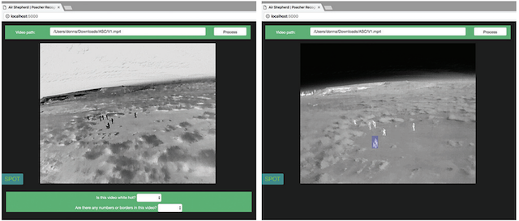
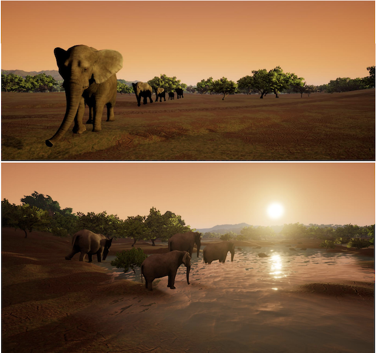
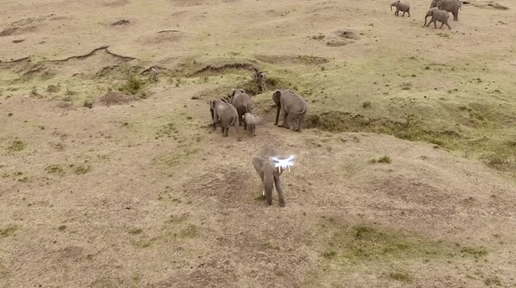

This survey is intended to consolidate recent efforts on animal conservation using remote imaging (UAVs, manned flights, or satellite imagery).  This page is maintained by <a href="https://www.wur.nl/en/Persons/Benjamin-BA-Benjamin-Kellenberger-MSc.htm">Benjamin Kellenberger</a> and <a href="http://dmorris.net">Dan Morris</a>.  Contributions are welcome!  Please submit additions or corrections as GitHub pull requests.

#  Contents

  [Research Articles](#ResearchArticles) 
  [Data Sets](#DataSets) 
  [Case Studies](#CaseStudies) 
  [Further Reading](#FurtherReading) 
 
 
 
#  Research Articles

**[Corcoran, E., Denman, S., Hanger, J., Wilson, B., & Hamilton, G. (2019). Automated detection of koalas using low-level aerial surveillance and machine learning. Scientific reports, 9(1), 3208.](https://www.nature.com/articles/s41598-019-39917-5.pdf)**

The authors employ an ensemble of off-the-shelf Faster R-CNN and YOLO models (predictions fused by averaging) to detect koalas. Noteworthy detail: double-counts due to overlapping images are resolved by finding correspondences (via ORB features) and averaging the detection heatmaps in the overlap zones.  Report precision values around 49%, but clarify that this is higher than the precision value associated with manual annotation for the same data.  Train and test on data from different sites, suggesting generalizability.

Dataset available on request.

&nbsp;&nbsp;&nbsp;&nbsp;&nbsp;&nbsp;  

**[Guirado, E., Tabik, S., Rivas, M. L., Alcaraz-Segura, D., & Herrera, F. (2019). Whale counting in satellite and aerial images with deep learning. Scientific reports, 9(1), 1-12.](https://www.nature.com/articles/s41598-019-50795-9)**

Find whales in satellite images.  Trained on data from a variety of sources (Google Earth, NOAA Photo Library, etc.).  Total training set was 700 images and 945 whales.  Tested on Google Earth images, downloaded 13k cells from areas known to have whales, only 68 of which did.

Use a sliding classifier to find possible-whale tiles (Inceptionv3), then find and count whales in those files with Faster-RCNN with an Inception-Resnet-v2 backbone.  Found F1's from 42% to 94% depending on region.

Code is <a href="https://github.com/EGuirado/CNN-Whales-from-Space">publicly available</a>.

&nbsp;&nbsp;&nbsp;&nbsp;&nbsp;&nbsp;  

**[Torney, C. J., Lloyd-Jones, D. J., Chevallier, M., Moyer, D. C., Maliti, H. T., Mwita, M., ... & Hopcraft, G. C. (2019). A comparison of deep learning and citizen science techniques for counting wildlife in aerial survey images. Methods in Ecology and Evolution, 10(6), 779-787.](https://besjournals.onlinelibrary.wiley.com/doi/abs/10.1111/2041-210X.13165)**

Compare Zooniverse results for wildebeest counting in aerial images to a CNN-based approach; find that the CNN is more accurate overall.

Use a custom implementation of YoloV3, to (1) reduce the number of anchor boxes, (2) allow only a single scale, and (3) modify the loss function to account for over-representation of negative pixels. 

<!-- No images from the paper make sense here -->
<!--&nbsp;&nbsp;&nbsp;&nbsp;&nbsp;&nbsp;  -->

**[Borowicz, A., Le, H., Humphries, G., Nehls, G., Höschle, C., Kosarev, V., & Lynch, H. J. (2019). Aerial-trained deep learning networks for surveying cetaceans from satellite imagery. PloS one, 14(10).](https://journals.plos.org/plosone/article?id=10.1371/journal.pone.0212532)**

Build a training set of whales in 2cm-resolution aerial imagery, then downsampled that to 31cm to match Worldview-3 resolution.  Trained binary CNNs to separate water and whale classes.  10-fold cross-validation with a 90/10 random train/val split.  Tried ResNet-152, DenseNet, and an SVM; best results were from ResNet.

&nbsp;&nbsp;&nbsp;&nbsp;&nbsp;&nbsp;  

**[Hong, Suk-Ju, et al. Application of Deep-Learning Methods to Bird Detection Using Unmanned Aerial Vehicle Imagery. Sensors 19.7 (2019): 1651.](https://www.mdpi.com/1424-8220/19/7/1651)**

Comparison of standard detectors (Faster R-CNN, R-FCN, SSD, YOLO) on birds. Consistent with expectations, "the test results show Faster R-CNN to be the most accurate and YOLO to be the fastest among the models."  Report average precision values around 80% and 95% for IOU thresholds of 0.5 and 0.3, respectively.  Do not address generalization; train/val split appears to be random.  Interesting detail: they also use bird decoys for data augmentation.

&nbsp;&nbsp;&nbsp;&nbsp;&nbsp;&nbsp;  

**[Rivas, A., Chamoso, P., González-Briones, A., & Corchado, J. (2018). Detection of cattle using drones and convolutional neural networks. Sensors, 18(7), 2048.](https://www.mdpi.com/1424-8220/18/7/2048)**

Heatmap-based animal detection in low-altitude imagery that provides relatively clear foreground/background separability. The authors use a custom CNN that is similar to LeNet.  Report a well-balanced 95% accuracy, but do not address generalization (train/test split was random).

&nbsp;&nbsp;&nbsp;&nbsp;&nbsp;&nbsp;  

**[Bondi, E., Fang, F., Hamilton, M., Kar, D., Dmello, D., Choi, J., ... & Nevatia, R. (2018, April). Spot poachers in action: Augmenting conservation drones with automatic detection in near real time. In Thirty-Second AAAI Conference on Artificial Intelligence.](https://www.aaai.org/ocs/index.php/AAAI/AAAI18/paper/download/16282/16380)**

Describe a framework that uses Faster R-CNN on thermal data to localize poachers. Primarily a systems paper; they evaluate on only a small collection of videos, but they also include a short case study on a real deployment.

&nbsp;&nbsp;&nbsp;&nbsp;&nbsp;&nbsp;  

**[Bondi, E., Dey, D., Kapoor, A., Piavis, J., Shah, S., Fang, F., ... & Tambe, M. (2018, June). Airsim-w: A simulation environment for wildlife conservation with uavs. In Proceedings of the 1st ACM SIGCAS Conference on Computing and Sustainable Societies (p. 40). ACM.](https://www.cais.usc.edu/wp-content/uploads/2018/05/bondi_camera_ready_airsim-w.pdf)**

Uses a rendering engine ([AirSim](https://github.com/microsoft/AirSim), based on the Unreal Engine) to simulate an African ecosystem and derive thermal signatures for detector training.

&nbsp;&nbsp;&nbsp;&nbsp;&nbsp;&nbsp;  

**[Kellenberger, B., Marcos, D., & Tuia, D. (2018). Detecting mammals in UAV images: Best practices to address a substantially imbalanced dataset with deep learning. Remote sensing of environment, 216, 139-153.](https://arxiv.org/pdf/1806.11368.pdf)**

This paper presents tricks to handle the scarcity of animals in UAV imagery, specifically (1) class weighting to reduce the impact of the background class, (2) over-representing images with positive examples early in training, (3) using discretized rotational augmentation (flips) early in training but random rotational augmentation later in training, (4) adding hard negatives late in training, (5) adding a "border" class around the edges of large animals.  They also introduce evaluation metrics that represent a more appropriate estimate of time-saving for wildlife surveys than traditional computer vision metrics.

Use ResNet-18 for feature generation, add two additional custom layers to turn those features into probabilities, then slide the whole network over images.

<!--Dataset <a href="https://zenodo.org/record/16445#.XcxfYFdKhaQ">freely available</a>.-->

&nbsp;&nbsp;&nbsp;&nbsp;&nbsp;&nbsp;  

**[Kellenberger, B., Volpi, M., & Tuia, D. (2017, July). Fast animal detection in UAV images using convolutional neural networks. In 2017 IEEE International Geoscience and Remote Sensing Symposium (IGARSS) (pp. 866-869). IEEE.](https://ieeexplore.ieee.org/document/8127090)**

Train a custom detector network based on an AlexNet backbone for detecting African mammals in UAV imagery.  Compare to Fast-RCNN with the same AlexNet backbone.  Find improved F1 and substantially improved computational performance with the custom model than with Fast-RCNN, at the cost of lower recall.

&nbsp;&nbsp;&nbsp;&nbsp;&nbsp;&nbsp;  

**[Okafor, E., Smit, R., Schomaker, L., & Wiering, M. (2017, July). Operational data augmentation in classifying single aerial images of animals. In 2017 IEEE International Conference on INnovations in Intelligent SysTems and Applications (INISTA) (pp. 354-360). IEEE.](http://www.ai.rug.nl/~mwiering/GROUP/ARTICLES/INISTA_Data_Augmentation_Okafor.pdf)**

**[Okafor, E., Schomaker, L., & Wiering, M. A. (2018). An analysis of rotation matrix and colour constancy data augmentation in classifying images of animals. Journal of Information and Telecommunication, 2(4), 465-491.](https://www.tandfonline.com/doi/full/10.1080/24751839.2018.1479932)**

These papers focus on maximizing the variability of the animals a CNN gets to see; the authors position individuals in all rotational variations across the screen, in-painting holes with nearest neighbors.

&nbsp;&nbsp;&nbsp;&nbsp;&nbsp;&nbsp;  

**[Chabot, D., Dillon, C., & Francis, C. (2018). An approach for using off-the-shelf object-based image analysis software to detect and count birds in large volumes of aerial imagery. Avian Conservation and Ecology, 13(1).](https://www.ace-eco.org/vol13/iss1/art15/ACE-ECO-2018-1205.pdf)**

Really comprehensive description of their tuning of ENVI's built-in segmentation approaches to detect snow geese in images with 4-5cm resolution.  Report <1% counting error relative to manual annotation.

&nbsp;&nbsp;&nbsp;&nbsp;&nbsp;&nbsp;  

<!--
**Chen, C. H., & Liu, K. H. (2017, June). Stingray detection of aerial images with region-based convolution neural network. In 2017 IEEE International Conference on Consumer Electronics-Taiwan (ICCE-TW) (pp. 175-176). IEEE.**

Two-page extended abstract. Use Faster R-CNN with a VGG backbone to detect stingrays in aerial imagery.  Trained on one video, tested on others from the same region.

&nbsp;&nbsp;&nbsp;&nbsp;&nbsp;&nbsp;  
-->

**[Rey, N., Volpi, M., Joost, S., & Tuia, D. (2017). Detecting animals in African Savanna with UAVs and the crowds. Remote sensing of environment, 200, 341-351.](https://arxiv.org/pdf/1709.01722)**

Mammal detection in the African savanna using hand-crafted features (histogram of colors, bag of visual words) and an exemplar SVM.

&nbsp;&nbsp;&nbsp;&nbsp;&nbsp;&nbsp;  

**[Andrew, W., Greatwood, C., & Burghardt, T. (2017). Visual localisation and individual identification of holstein friesian cattle via deep learning. In Proceedings of the IEEE International Conference on Computer Vision (pp. 2850-2859).](http://openaccess.thecvf.com/content_ICCV_2017_workshops/papers/w41/Andrew_Visual_Localisation_and_ICCV_2017_paper.pdf)**

Combination of off-the-shelf models (R-CNN and a KCF tracker) for cattle monitoring.

&nbsp;&nbsp;&nbsp;&nbsp;&nbsp;&nbsp;  

**[Longmore, S. N., Collins, R. P., Pfeifer, S., Fox, S. E., Mulero-Pázmány, M., Bezombes, F., ... & Wich, S. A. (2017). Adapting astronomical source detection software to help detect animals in thermal images obtained by unmanned aerial systems. International Journal of Remote Sensing, 38(8-10), 2623-2638.](https://arxiv.org/pdf/1701.01611.pdf)**

This paper does peak finding by thresholding, followed by HOG and SVM, to detect animals in thermal imagery.

&nbsp;&nbsp;&nbsp;&nbsp;&nbsp;&nbsp;  

**[Maire, F., Alvarez, L. M., & Hodgson, A. (2015, November). Automating marine mammal detection in aerial images captured during wildlife surveys: a deep learning approach. In Australasian Joint Conference on Artificial Intelligence (pp. 379-385). Springer, Cham.](https://www.researchgate.net/publication/315529306_Automating_Marine_Mammal_Detection_in_Aerial_Images_Captured_During_Wildlife_Surveys_A_Deep_Learning_Approach)**

Find dugongs in UAV images using a two-stage approach: SLIC (Simple Linear Iterative Clustering) to segment the image into regions, then a custom CNN to classify regions as dugong and not-dugong.  Report F1 in the neighborhood of 0.4. Data were publicly available but no longer appear to be up.

&nbsp;&nbsp;&nbsp;&nbsp;&nbsp;&nbsp;  

**[Yang, Z., Wang, T., Skidmore, A. K., de Leeuw, J., Said, M. Y., & Freer, J. (2014). Spotting east African mammals in open savannah from space. PloS one, 9(12), e115989.](https://journals.plos.org/plosone/article?id=10.1371/journal.pone.0115989)**

Survey East African mammals (wildebeest and zebra) using GeoEye satellite data, natively 2m, sharpened to 0.5m.  Use a custom NN (this is mostly pre-CNNs) to classify each pixel as animal/tree/etc., then used image processing and rule-based analyses to find animals from the classification output raster.  Report <10% counting error relative to humans.  Quite impressive since animals are somewhere around 3-4 pixels long even in the sharpened images.

&nbsp;&nbsp;&nbsp;&nbsp;&nbsp;&nbsp;  

**[van Gemert, J. C., Verschoor, C. R., Mettes, P., Epema, K., Koh, L. P., & Wich, S. (2014, September). Nature conservation drones for automatic localization and counting of animals. In European Conference on Computer Vision (pp. 255-270). Springer, Cham.](https://staff.fnwi.uva.nl/p.s.m.mettes/papers/drones-eccvw14.pdf)**

Traditional ML methods (DPM, eSVM) for cattle detection. They also do counting using videos and a KLT tracker. One of the early works, with a straightforward dataset.

&nbsp;&nbsp;&nbsp;&nbsp;&nbsp;&nbsp;  

**[Grenzdörffer, G. J. (2013). UAS-based automatic bird count of a common gull colony. International archives of the photogrammetry, Remote sensing and spatial information sciences, 1, W2.](https://www.int-arch-photogramm-remote-sens-spatial-inf-sci.net/XL-1-W2/169/2013/isprsarchives-XL-1-W2-169-2013.pdf)**

Train a classifier to recognize birds in hyperspectral UAS images, but not a lot of technical detail is provided because they leveraged tools built into ArcGIS.  Also address canopy height determination from a 3D point cloud collected concurrently with the bird survey.

&nbsp;&nbsp;&nbsp;&nbsp;&nbsp;&nbsp;  

# Data Sets

- <a href="http://lila.science/datasets/arcticseals">NOAA Arctic Seals Data</a> (1M thermal/RGB pairs, ~7k seals annotated w/bounding boxes)
- <a href="https://zenodo.org/record/3234780">The Aerial Elephant Dataset</a> (~2k images, ~15.5k elephants annotated)

# Case Studies

**Delair / Bathawk**

Collaboration between drone manufacturer [Delair](https://delair.aero/antipoaching-operations-with-drones/) and Tanzanian anti-poaching service [Bathawk Recon](https://www.linkedin.com/company/bathawk-recon/about/). Used mainly IR footage for detecting poachers and mammals.  Presented as a [video](https://www.youtube.com/watch?v=OvRA8aWttq4).

&nbsp;&nbsp;&nbsp;&nbsp;&nbsp;&nbsp;  

**Mara Elephant Project / DJI**

Collaboration between the [Mara Elephant Project](https://maraelephantproject.org/unmanned-aerial-vehicles-hec-mitigation/) and drone manufacturer [DJI](https://www.dji.com/).  Presented as a [video](https://www.youtube.com/watch?v=DWE72zf4WVQ).

&nbsp;&nbsp;&nbsp;&nbsp;&nbsp;&nbsp;  

**Where’s Bunga? Tracking Orangutans with Drones and Gnu-Radio**

Technical POC created by [Dirk Gorissen](https://dirkgorissen.com/) in collaboration with [International Animal Rescue](https://www.internationalanimalrescue.org).  Deployed a semi-automatic drone to identify orangutans in the Bornean rainforest. 

> <https://dirkgorissen.com/2019/01/06/wheres-pinoh-tracking-orangutans-with-drones-and-gnu-radio>

> <https://dirkgorissen.com/2016/04/19/wheres-susi-airborne-orangutan-tracking-with-python-and-react-js>

&nbsp;&nbsp;&nbsp;&nbsp;&nbsp;&nbsp;  

**JGI / ConservationDrones.org**

Collaboration between the [Jane Goodall Institute of Canada](https://janegoodall.ca) and [ConservationDrones.org](https://conservationdrones.org/) to explore drone use in a Congolese reserve. Mentioned applications include censuses of chimpanzees.  Presented as a [video](https://www.youtube.com/watch?v=cUzdCH-PDy4).

> <https://conservationdrones.org/2015/05/06/view-from-above-using-drones-to-help-support-jane-goodall-institute-conservation-efforts-in-congo/>

&nbsp;&nbsp;&nbsp;&nbsp;&nbsp;&nbsp;  

**Deep Reality Simulation for Automated Poacher Detection**

Leverages AirSim-W (see paper by Bondi et al. above) to generate synthetic thermal imagery for training poacher detection models.  Uses Faster R-CNN, domain adaptation using GANs, and an implementation using MS Azure and Apache Spark.

> <https://databricks.com/session/distributed-deep-domain-adaptation-for-automated-poacher-detection>

Also see accompanying [video](https://www.youtube.com/watch?v=m5vAF231XZQ).

&nbsp;&nbsp;&nbsp;&nbsp;&nbsp;&nbsp;  

**Hensoldt**

German sensor manufacturer [Hensoldt](https://www.hensoldt.net/) presents a program intended to stem rhino poaching in South Africa in this [video](https://www.youtube.com/watch?v=4nCCYckAQDc).

&nbsp;&nbsp;&nbsp;&nbsp;&nbsp;&nbsp;  

#  Further Reading

- [ConservationDrones.org blog: applications](https://conservationdrones.org/category/drone-applications/) (incredible collection of additional case studies)
- [ConservationDrones.org blog: publications](https://conservationdrones.org/publications-on-drones-and-conservation/) (incredible collection of additional research papers)
- [Awesome Deep Ecology](https://github.com/patrickcgray/awesome-deep-ecology) (review of deep learning applications in ecology)
- [Camera Trap ML Survey](https://agentmorris.github.io/camera-trap-ml-survey/) (analogous list for camera traps)

## Review articles

Chabot, D., & Francis, C. M. (2016). Computer-automated bird detection and counts in high-resolution aerial images: a review. Journal of Field Ornithology, 87(4), 343-359.

