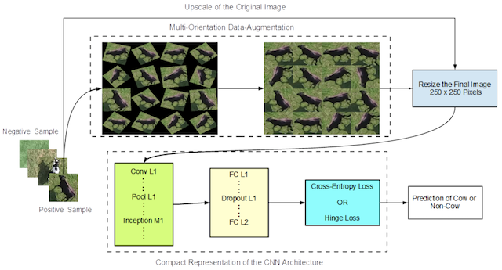
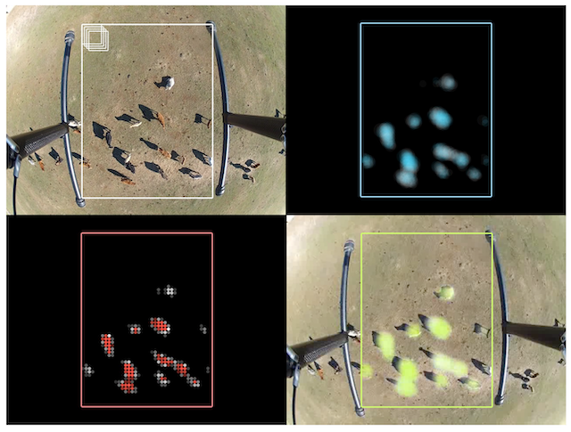
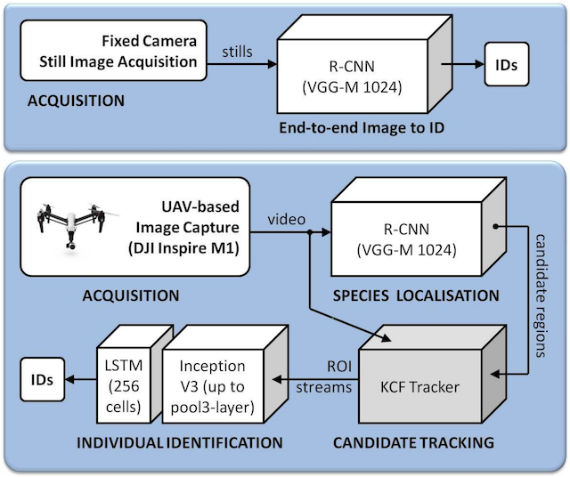
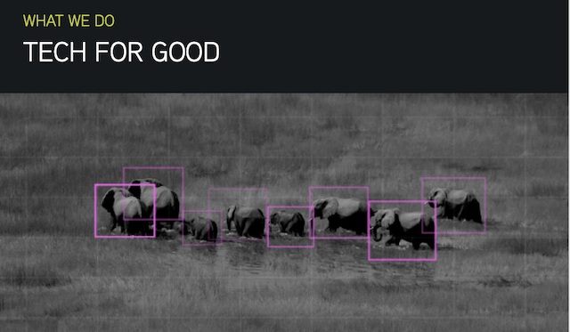

# Computer Vision and Aerial Imagery for Wildlife Conservation

This page is intended to consolidate recent efforts on animal conservation using remote sensing (mainly Unmanned Aerial Vehicles (UAVs), or drones).

## Research Articles

This section primarily covers work that uses computer vision and machine learning (in particular deep learning) on aspects around wildlife conservation using drones (e.g. animal detection or tracking).

The list is organized into topics, and therein ordered alphabetically by the last name of the first author. If possible, links, images and a brief summary are provided.

**Keywords**
*Note that these "links" do not really work; they're just marked up as such to make them stand out a bit. Best to use your browser's built-in search function.*
[Deep Learning](#deepLearning), [ResNet](#resnet), [Faster R-CNN](#frcnn), [R-FCN](#rfcn), [SSD](#ssd), [YOLO](#yolo)

[SVM](#svm), [Exemplar SVM](#esvm)

[Kanade-Lucas-Tomasi](#klt), [Kernelized Correlation Filter](#kcf)

[Marine](#marine), [Cattle](#cattle), [Wild Mammals](#wildMammals), [Birds](#birds)

### Animal Detection

**Chen, Chien-Hung, and Keng-Hao Liu. "Stingray detection of aerial images with region-based convolution neural network." _2017 IEEE International Conference on Consumer Electronics-Taiwan (ICCE-TW)_. IEEE, 2017.**
*(description still pending)*
[Deep Learning](#deepLearning), [Faster R-CNN](#frcnn), [Marine](#marine)

**[Corcoran, Evangeline, et al. "Automated detection of koalas using low-level aerial surveillance and machine learning." Scientific reports 9.1 (2019): 3208.](https://www.nature.com/articles/s41598-019-39917-5.pdf)**

*The authors employ an ensemble of off-the-shelf Faster R-CNN and YOLO models (predictions fused by averaging) to detect Koalas. Noteworthy detail: double-counts due to overlapping images are resolved by finding correspondences (via ORB features) and averaging the detection heatmaps in the overlap zones.
Dataset available on request.*
[Deep Learning](#deepLearning), [Faster R-CNN](#frcnn), [YOLO](#yolo), [Wild Mammals](#wildMammals)

**[van Gemert, Jan C., et al. "Nature conservation drones for automatic localization and counting of animals." European Conference on Computer Vision. Springer, Cham, 2014.](https://staff.fnwi.uva.nl/p.s.m.mettes/papers/drones-eccvw14.pdf)**

*Traditional ML methods (DPM, eSVM) for cattle detection. They also do counting using videos and a KLT tracker. One of the early works, with a straight-forward dataset.*
[Exemplar SVM](#esvm), [Kanade-Lucas-Tomasi](#klt), [Cattle](#cattle)

**[Hong, Suk-Ju, et al. "Application of Deep-Learning Methods to Bird Detection Using Unmanned Aerial Vehicle Imagery." Sensors 19.7 (2019): 1651.](https://www.mdpi.com/1424-8220/19/7/1651)**

*Comparison of standard detectors (Faster R-CNN, R-FCN, SSD, YOLO) on birds. Interesting detail: they also use bird decoys for further augmentations.*
[Deep Learning](#deepLearning), [Faster R-CNN](#frcnn), [R-FCN](#rfcn), [SSD](#ssd), [YOLO](#yolo), [Birds](#birds)

**[Kellenberger, Benjamin, Diego Marcos, and Devis Tuia. "Detecting mammals in UAV images: Best practices to address a substantially imbalanced dataset with deep learning." Remote sensing of environment 216 (2018): 139-153.](https://arxiv.org/pdf/1806.11368.pdf)**

*This paper presents tricks to handle the scarcity of animals in UAV imagery.
Dataset freely available.*
[Deep Learning](#deepLearning), [ResNet](#resnet), [Wild Mammals](#wildMammals)

**[Okafor, Emmanuel, et al. "Operational data augmentation in classifying single aerial images of animals." 2017 IEEE International Conference on INnovations in Intelligent SysTems and Applications (INISTA). IEEE, 2017.](http://www.ai.rug.nl/~mwiering/GROUP/ARTICLES/INISTA_Data_Augmentation_Okafor.pdf)**
*and*
**[Okafor, Emmanuel, Lambert Schomaker, and Marco A. Wiering. "An analysis of rotation matrix and colour constancy data augmentation in classifying images of animals." Journal of Information and Telecommunication 2.4 (2018): 465-491.](https://www.tandfonline.com/doi/full/10.1080/24751839.2018.1479932)**

*These papers’ main focus lies on maximizing the variability of the animals a CNN gets to see; to this end the authors propose to position individuals in all rotational variations across the screen, in-painting the holes in-between with nearest neighbors.*
[Deep Learning](#deepLearning), [Cattle](#cattle)

**[Rey, Nicolas, et al. "Detecting animals in African Savanna with UAVs and the crowds." Remote sensing of environment 200 (2017): 341-351.](https://arxiv.org/pdf/1709.01722)**

*Work performing big mammal detection in the African Savanna using hand-crafted features (Histogram of Colors, Bag of Visual Words) and an Exemplar SVM.*
[Exemplar SVM](#esvm), [Wild Mammals](#wildMammals)

**[Rivas, Alberto, et al. "Detection of Cattle Using Drones and Convolutional Neural Networks." Sensors 18.7 (2018): 2048.](https://www.mdpi.com/1424-8220/18/7/2048)**

*Heatmap-based animal detection with low flying altitude and comparably clear foreground/background separability. The authors use a small, custom CNN that is similar to LeNet.*
[Deep Learning](#deepLearning), [Cattle](#cattle)

### Animal Tracking

**[Andrew, William, Colin Greatwood, and Tilo Burghardt. "Visual localisation and individual identification of Holstein Friesian cattle via deep learning." Proceedings of the IEEE International Conference on Computer Vision. 2017.](http://openaccess.thecvf.com/content_ICCV_2017_workshops/papers/w41/Andrew_Visual_Localisation_and_ICCV_2017_paper.pdf)**

*Combination of off-the-shelf models (R-CNN and a KCF tracker) for cattle monitoring.*
[Deep Learning](#deepLearning), [Kernelized Correlation Filter](#kcf)

### Thermal Imagery

**[Longmore, S. N., et al. "Adapting astronomical source detection software to help detect animals in thermal images obtained by unmanned aerial systems." International Journal of Remote Sensing 38.8-10 (2017): 2623-2638.](https://arxiv.org/pdf/1701.01611.pdf)**

*This paper does peak finding by thresholding, followed by HOG and SVM, to detect animals in thermal imagery.*
[SVM](#svm)

**[Bondi, Elizabeth, et al. "Spot poachers in action: Augmenting conservation drones with automatic detection in near real time." Thirty-Second AAAI Conference on Artificial Intelligence. 2018.](https://www.aaai.org/ocs/index.php/AAAI/AAAI18/paper/download/16282/16380)**

*An integrated, cloud-based framework that uses Faster R-CNN on thermal data to localize poachers.*
[Deep Learning](#deepLearning), [Faster R-CNN](#frcnn)

**[Bondi, Elizabeth, et al. "Airsim-w: A simulation environment for wildlife conservation with uavs." Proceedings of the 1st ACM SIGCAS Conference on Computing and Sustainable Societies. ACM, 2018.](https://www.cais.usc.edu/wp-content/uploads/2018/05/bondi_camera_ready_airsim-w.pdf)**

*Using a rendering engine (AirSim, based on the Unreal Engine) to simulate an African ecosystem and derive thermal signatures from to train a detector.*
[Wild Mammals](#wildMammals)

***

## Case Studies

### Anti-Poaching in Tanzania

Collaboration of drone manufacturer [Delair](https://delair.aero/antipoaching-operations-with-drones/) and Tanzanian anti-poaching service [Bathawk Recon](https://www.youtube.com/channel/UC4tla1LJh4UOeg9F_AV1LEw). Used mainly IR footage for detecting poachers as well as mammals.
*See also:* [Video](https://www.youtube.com/watch?v=OvRA8aWttq4)

### Protecting Kenya's Elephants from Above

One of the efforts made by the [Mara Elephant Project](https://maraelephantproject.org/unmanned-aerial-vehicles-hec-mitigation/) in collaboration with manufacturer [Expert Drones](http://www.expertdrones.com/).
*See also:* [Video](https://www.youtube.com/watch?v=DWE72zf4WVQ)

### Where’s Bunga? Tracking Orangutans with Drones and Gnu-Radio

Study involved the [International Animal Rescue](https://www.internationalanimalrescue.org) organization and deployed a semi-automatic drone to identify Orangutans in the Bornean rainforest. Drone by [Vulcan UAV](http://vulcanuav.com/) (not to be mistaken with [Vulcan Inc.](https://vulcan.com/)).

[Link to site](https://dirkgorissen.com/2019/01/06/wheres-pinoh-tracking-orangutans-with-drones-and-gnu-radio/), [Previous version](https://dirkgorissen.com/2016/04/19/wheres-susi-airborne-orangutan-tracking-with-python-and-react-js/) (both incl. videos)

### Chimpanzee censuses in Tchimpounga, Congo

Collaboration between the [Jane Goodall Institute of Canada](https://janegoodall.ca) and [Conservation Drones](https://conservationdrones.org/) on drone employment in a Congolesian reserve. Mentioned applications include censuses of chimpanzees.
[Video](https://www.youtube.com/watch?v=cUzdCH-PDy4)

## Organizations

These are enterprises, startups, NGOs and the like that are involved in some way with animal conservation.

### [ConservationDrones](https://conservationdrones.org/)

### [Vulcan Inc.](https://vulcan.com/)

Company engaged in multifarious projects, also for [conservation](http://engineering.vulcan.com/2019_0513_Partnerships-and-the-collaborative-appro.aspx).
[Blog](http://engineering.vulcan.com/blog?topic=Wildlife_Conservation) on wildlife conservation.